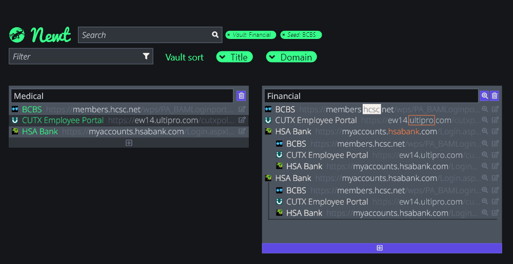

# Newt | New Tab Seeder
Newt will solve the problem of too many tabs in a way that encourages closing tabs. Some [browser](https://chrome.google.com/webstore/detail/cluster-window-tab-manage/aadahadfdmiibmdhfmpbeeebejmjnkef?hl=en) [addons](https://addons.mozilla.org/en-US/firefox/addon/simple-tab-groups/) solve this with grouping tabs into containers, which as a user of these has been a great stopgap.

On top of UI changes I have been wanting to make to similar products, I also propose that tabs should be able to be frozen in place - to the exact spot you were reading so you don't have to remember. By incorporating this with a small browser extension script, Newt will give you ultimate control over how you search, sort, filter, arrange, combine, nest, and freeze tabs.

Inspired by [Svalbard Global Seed Vault](https://www.croptrust.org/our-work/svalbard-global-seed-vault).

|  |
|:--:|
| *Rough first sketch, to give you an idea.* |

## Features / To Do

<ol>
  <li>Remembers scroll position on page and even points you to the exact sentence you should read next.</li>
  <li>Spacebar pans around screen.</li>
  <li>Search and filter as you type.</li>
  <li>Google/Duckduckgo search only certain sites.</li>
  <li>Nested sub-containers.</li>
  <li>Recent URLs automatically go to top of seed vault.</li>
  <li>Tags for URLs.</li>
  <li>Spontaneous reminders of historical tabs.</li>
  <li>Rate/score URL seeds/plants/seed vault.</li>
  <li>Shareable pods/packages.</li>
</ol>

## Definitions

*seed*
: The building block URL. It does not have to be truncated to the domain name + TLD. For example, the seed could be the URL to the login page.

*strain / variant*
: Another URL based on the same domain as the seed. Useful for creating quick links to frequently visited endpoints of the same domain as the seed.

*stash*
: A collection of seeds.

## Tech Stack
- HTML
- SCSS
- Bootstrap 5
- JavaScript
- Babel?
- ESLint
- React (create-react-app)
- JSX
- Node
- NPM
- Yarn
- Testing - [Jest?](https://jestjs.io/docs/en/getting-started)
- Webpack?
